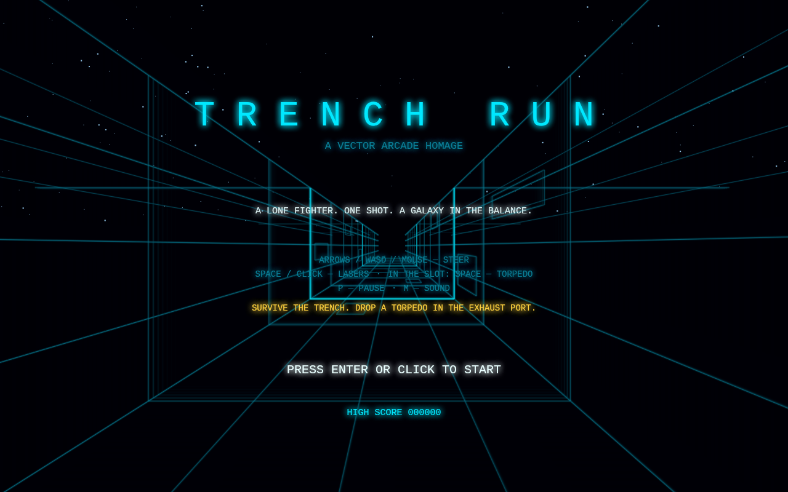
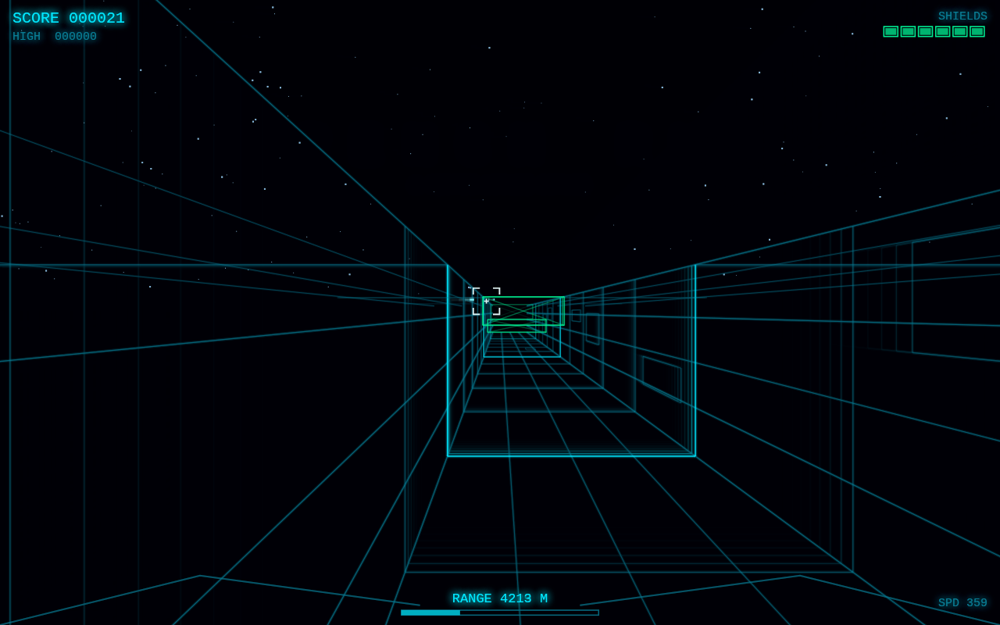

# TRENCH RUN

A fast, retro **vector-wireframe arcade game** inspired by the iconic Death Star
trench run — and by the glowing vector graphics of the classic 1983 arcade
cabinet. Built as a **single self-contained HTML file**: no dependencies, no
build step, no asset files (even the sound is synthesized live with WebAudio).



## Play

Open `index.html` in any modern browser. That's it.

```bash
# or serve it locally
python3 -m http.server 8000   # then visit http://localhost:8000
```



## How to play

Fly down the trench, survive to the end, and drop a proton torpedo into the
exhaust port.

| Control | Action |
| --- | --- |
| Arrow keys / WASD / mouse | Steer |
| Space / click | Fire lasers |
| F / tap (during the final approach) | Fire torpedoes |
| P | Pause |
| M | Toggle sound |
| Enter | Start / restart |

- **Dodge** crossbeams, slabs, and gates blocking the trench. Reading them is
  easy: solid structure is filled, openings are black — and any structure you
  are currently on course to hit glows **red** and pulses (with a warning
  tick as it closes in), while a **green** structure means your line is
  clear. If your reticle turns red, move.
- **Shoot** wall and floor turrets (150 pts) and enemy fighters (250 pts)
  before their fire strips your six shield cells.
- **The finale:** when the range meter hits zero the targeting computer comes
  on — but get close enough and a ghostly voice tells you to *use the Force*.
  The computer switches off; hold the center line, wait for the words to glow,
  and press **F** (or tap) to take the shot on feel. Miss, and you loop around
  for another pass — each pass is harder.
- Victory pays +5000, plus +500 for every shield cell you kept. High score
  persists in `localStorage`.

Touch is supported: drag to steer, hold to fire, tap to launch torpedoes.

## Tech notes

- Hand-rolled 3D: perspective projection onto a 2D canvas, wireframe
  rendering with a phosphor-persistence trail effect, near-plane line
  clipping, and distance fog.
- Procedural trench detail from a deterministic hash, so the walls are
  varied but stable frame to frame.
- All sound effects (lasers, explosions, torpedo, lock tone, engine hum that
  pitches with speed) are synthesized on the fly with the WebAudio API.
- The voice cue is generated live by the browser's speech-synthesis engine —
  still zero audio assets.

An original homage — no Star Wars assets, names, or trademarks are used.
